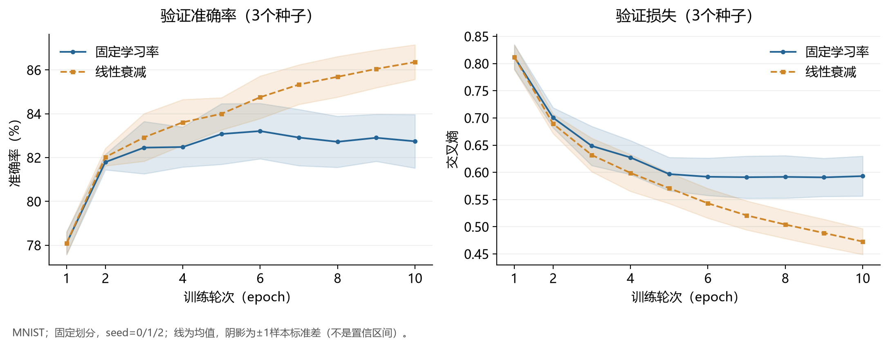
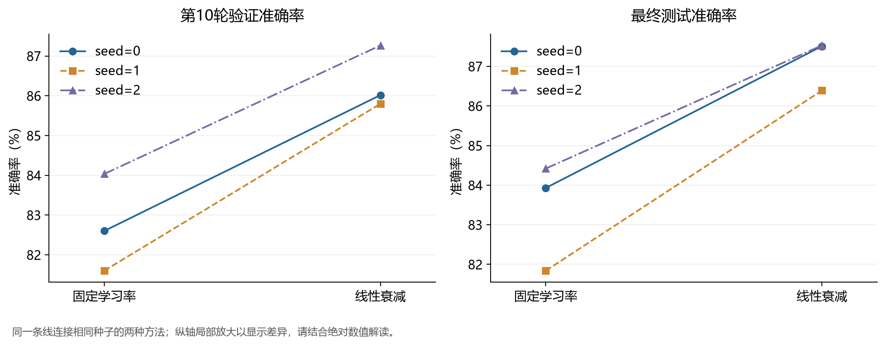

# MNIST 分类与 GHA 学习率衰减实验

本仓库整理脑启发人工智能课程的 MNIST 实验：比较单层分类器与多层感知机、不同激活函数，以及 BP、Oja、GHA 和冻结隐藏层的学习方案；在此基础上，补充比较 GHA 固定学习率和线性衰减学习率。

课程原始代码来自 [VeriTas-arch/brain-inspired-ai](https://github.com/VeriTas-arch/brain-inspired-ai)，保留原作者及 MIT 许可证。补充实验不是课程原作者提供的结果。实验整理与说明使用 AI 辅助，数值来自实际运行并保存的输出。

## 文件从哪里看

- `biai-mlp-0.1.0/mlp.ipynb`：课程 Notebook，保留已运行的输出和图。
- `biai-mlp-0.1.0/biai/`：Notebook 与补充脚本依赖的路径、随机种子和参数校验工具。
- `gha-decay/run_experiment.py`：补充实验入口，读取 Notebook 中的模型和 GHA 定义，不会执行整本 Notebook。
- `gha-decay/results/`：报告采用的实验方案、完整精度结果及六个最终模型。
- `tables/`：原实验与补充实验的 CSV 表格。
- `figures/`：结果图，可直接查看。
- `PROVENANCE.md`：发布整理范围、数据出处及复现边界。

只看结果无需安装软件；要重新训练，按下面步骤操作。仓库不包含 MNIST 数据、虚拟环境或完整课程报告。

## 运行准备

以下命令在**仓库根目录**的终端运行，即能看到本 README 的目录。可以在 GitHub 点击 **Code → Download ZIP** 后解压，或使用 Git：

```bash
git clone https://github.com/yeke1784/mnist-gha-learning.git
cd mnist-gha-learning
```

推荐 Python 3.12。已有课程 `brain_ai` 环境时直接激活，不必重复创建或升级软件：

```bash
conda activate brain_ai
```

如果没有环境，可自行创建并安装依赖：

```bash
conda create -n brain_ai python=3.12
conda activate brain_ai
python -m pip install -r requirements.txt
```

`requirements.txt` 列出所需软件，不锁定版本；安装到不同版本时，结果可能有微小变化。原补充实验记录为 Python 3.12.13、PyTorch 2.14.0+cu126，实际使用 CPU、4 线程及确定性运算，不要求 NVIDIA 显卡。发布复核时的 torchvision、NumPy、Matplotlib 版本分别为 0.29.0+cu126、2.5.2、3.11.2；这是环境记录，不是对其他版本兼容性的保证。

### 准备 MNIST

第一次运行时联网下载到约定的位置：

```bash
python -c "from torchvision.datasets import MNIST; root='biai-mlp-0.1.0/data'; MNIST(root, train=True, download=True); MNIST(root, train=False, download=True)"
```

也可以把课程包原有的 `data/MNIST/` 文件夹复制到 `biai-mlp-0.1.0/data/MNIST/`，无需重复下载。四个解压后的原始文件应位于 `data/MNIST/raw/`。网络下载失败时优先使用课程数据，不要把数据文件上传到仓库。

## 运行课程基础实验

1. 用 VS Code 打开 `biai-mlp-0.1.0` 子目录。
2. 打开 `mlp.ipynb`，选择已安装上述依赖的 Python 内核。
3. 保持 `USE_NETWORK_DATA = False`，因为前一步已把数据放在本地。
4. 从上至下运行所有单元格。

依次得到数据样例、单层与多层网络对照、手工反向传播、激活函数对照、BP/Oja/GHA/Frozen 对照。每轮输出训练和验证指标，最后输出测试准确率及图。Notebook 根据设备条件选择 CPU 或 GPU，不同设备结果不保证逐位一致。

注意：子目录中的课程 README 按“课程包自带数据”编写；本 GitHub 仓库不自带数据，应以前面的准备步骤为准。

## 运行 GHA 补充实验

回到仓库根目录，执行：

```bash
python gha-decay/run_experiment.py --output runs/reproduce-01
```

不要把输出写到已有的 `gha-decay/results/`；那里保存的是报告原始结果。脚本发现输出目录已有 `protocol.json` 时会拒绝覆盖。再次运行请使用 `runs/reproduce-02` 等新目录。

脚本使用固定数据划分：54,000 个训练样本、6,000 个验证样本、10,000 个测试样本。网络为 784→128→10、ReLU、无偏置，每组训练 10 轮，batch size 为 64。

- 隐藏层用 GHA 更新；输出层用有标签的交叉熵和 SGD 更新，学习率为 0.05。
- 固定组的隐藏层学习率始终为 0.001。
- 衰减组从 0.001 逐轮线性降到 0.0001。
- 随机种子为 0、1、2；同一种子的两组使用相同初始化和样本顺序。
- 六次训练全部完成后，才对六个最终模型分别进行一次测试集评估，不按测试表现选模型。

终端应显示 **60 行逐轮训练信息、6 行 TEST 结果**，最后出现 `COMPLETE`。输出目录包含 `protocol.json`、`results.json`、6 个逐次结果 JSON 和 6 个 `.pt` 模型文件。脚本也会检查 GHA 公式、配对初始化、批次顺序、首轮一致性、参数有限性及原 Notebook 未被改动；断言失败说明检查未通过，不应忽略。

## 已保存结果如何解读

基础实验的测试准确率：

| 对照 | 测试准确率 |
|---|---:|
| 单层线性分类器 | 91.97% |
| 多层感知机（ReLU） | 96.56% |
| 激活函数：Sigmoid / Tanh | 92.54% / 95.95% |
| 学习规则：BP / Oja / GHA / Frozen | 96.47% / 10.09% / 83.93% / 81.57% |

以上属于不同实验小节，配置不完全相同，例如学习规则对照采用无偏置网络；不要把全部数值当成完全相同条件下的同一组比较。

补充实验的最终测试准确率如下：

| 随机种子 | 固定学习率 | 线性衰减 | 配对差值 |
|---|---:|---:|---:|
| 0 | 83.93% | 87.51% | +3.58 个百分点 |
| 1 | 81.84% | 86.39% | +4.55 个百分点 |
| 2 | 84.42% | 87.53% | +3.11 个百分点 |
| 均值 ± 样本标准差 | 83.40% ± 1.37% | 87.14% ± 0.65% | 平均 +3.75 个百分点 |

最终验证准确率从 82.74% ± 1.22% 提高到 86.36% ± 0.79%。标准差按三个随机种子计算（分母 n−1），不是置信区间。JSON 中准确率以 0–1 小数记录，表格中转为百分数。





在本实验设置和三个种子下，线性衰减的最终分类准确率均高于固定学习率。该结果不等于已经证明统计显著性、普遍优越性或稳定性的因果机制。隐藏层权重的平均绝对余弦相似度越低，表示方向更分散，但不自动意味着分类更好。GHA/Oja 的隐藏层更新不使用标签，输出层仍使用标签，因此不是完全无监督的端到端分类。

## 报告引用

可写：“补充实验代码、运行说明和结果文件见本项目 GitHub 仓库。”为避免之后修改影响读者核对，最终报告推荐使用某次提交的固定链接（在仓库中查看提交记录并选择对应版本），而不仅是会随更新变化的 `main` 分支链接。

## 许可

课程代码的 MIT 许可及原作者声明保存在 `biai-mlp-0.1.0/LICENSE`，未作删除或替换。本仓库未替补充代码另行授予开源许可证；公开可查看不等同于全部材料均可任意使用。MNIST 数据集的使用条件以其原始来源为准。
